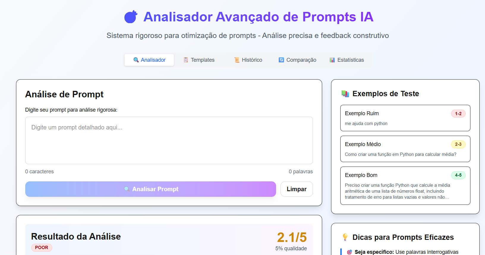

# 🎯 Analisador Avançado de Prompts IA

Sistema completo para análise e otimização de prompts direcionados a IAs, desenvolvido com **Next.js 14**, **TypeScript** e **Tailwind CSS** seguindo **Clean Architecture**.



s

## 📋 Índice

- [🎯 Sobre o Projeto](#-sobre-o-projeto)
- [✨ Funcionalidades](#-funcionalidades)
- [🏗️ Arquitetura](#️-arquitetura)
- [🚀 Instalação](#-instalação)
- [📁 Estrutura do Projeto](#-estrutura-do-projeto)
- [🎪 Como Usar](#-como-usar)
- [🔧 Tecnologias](#-tecnologias)
- [📊 Algoritmo de Análise](#-algoritmo-de-análise)
- [🎨 Interface](#-interface)
- [🤝 Contribuindo](#-contribuindo)
- [📄 Licença](#-licença)

## 🎯 Sobre o Projeto

O **Analisador Avançado de Prompts IA** é uma ferramenta educativa que ajuda desenvolvedores, pesquisadores e profissionais a criar prompts mais eficazes para IAs. O sistema oferece análise detalhada, feedback construtivo e sugestões de melhoria baseadas em critérios científicos.

### 🎪 Demonstração

Experimente os diferentes tipos de prompts:

- **Prompt Ruim**: `"me ajuda com python"` → Score: 1-2/5
- **Prompt Médio**: `"Como criar uma função em Python para calcular média?"` → Score: 2-3/5
- **Prompt Bom**: `"Preciso implementar uma função Python que calcule a média aritmética de uma lista de números, incluindo tratamento de erros..."` → Score: 4-5/5

## ✨ Funcionalidades

### 🔍 **Análise Rigorosa**

- **6 critérios de avaliação**: Comprimento, especificidade, clareza, contexto, palavras de ação e complexidade
- **Sistema de pontuação ponderado** com pesos diferentes para cada critério
- **Detecção de problemas**: Palavras vagas, falta de contexto, estrutura inadequada
- **Estimativa de qualidade realista** (5-100%) baseada em múltiplos fatores

### 📊 **Dashboard Completo**

- **5 abas especializadas**:
  - 🔍 **Analisador**: Análise detalhada em tempo real
  - 📋 **Templates**: 4 templates inteligentes para diferentes contextos
  - 📜 **Histórico**: Últimas 20 análises com sistema de rating
  - 🔄 **Comparação**: Análise lado a lado (original vs melhorado)
  - 📊 **Estatísticas**: Insights personalizados e métricas de progresso

### 🧠 **IA Inteligente**

- **Detecção automática** de tecnologias (Python, Java, JavaScript, etc.)
- **Prompts realmente melhorados** (não apenas templates)
- **Contexto específico** para cada área (web, mobile, dados, etc.)
- **Casos especiais** para funções, aprendizado e resolução de problemas

### 🎨 **Interface Moderna**

- **Design responsivo** com Tailwind CSS
- **Animações suaves** e micro-interações
- **Tema consistente** com gradientes e cores modernas
- **Acessibilidade** com navegação por teclado e screen readers

## 🏗️ Arquitetura

O projeto segue os princípios da **Clean Architecture**:

```
┌────────────────────────────────────────────────────────────────┐
│                    Presentation Layer                          │
│  ┌─────────────────┐  ┌─────────────────┐  ┌─────────────────┐ │
│  │   Components    │  │      Pages      │  │       UI        │ │
│  │   (React)       │  │   (Next.js)     │  │   (Tailwind)    │ │
│  └─────────────────┘  └─────────────────┘  └─────────────────┘ │
└────────────────────────────────────────────────────────────────┘
┌────────────────────────────────────────────────────────────────┐
│                    Application Layer                           │
│  ┌─────────────────┐  ┌─────────────────┐  ┌─────────────────┐ │
│  │     Hooks       │  │   Use Cases     │  │   State Mgmt    │ │
│  │   (Custom)      │  │   (Business)    │  │   (React)       │ │
│  └─────────────────┘  └─────────────────┘  └─────────────────┘ │
└────────────────────────────────────────────────────────────────┘
┌────────────────────────────────────────────────────────────────┐
│                     Domain Layer                               │
│  ┌─────────────────┐  ┌─────────────────┐  ┌─────────────────┐ │
│  │    Entities     │  │  Value Objects  │  │  Business Rules │ │
│  │ (PromptAnalyzer)│  │    (Types)      │  │  (Pure Logic)   │ │
│  └─────────────────┘  └─────────────────┘  └─────────────────┘ │
└────────────────────────────────────────────────────────────────┘
┌────────────────────────────────────────────────────────────────┐
│                  Infrastructure Layer                          │
│  ┌─────────────────┐  ┌─────────────────┐  ┌─────────────────┐ │
│  │   Utilities     │  │ Configuration   │  │   External      │ │
│  │   (Helpers)     │  │  (Tailwind)     │  │   (Future)      │ │
│  └─────────────────┘  └─────────────────┘  └─────────────────┘ │
└────────────────────────────────────────────────────────────────┘
```

## 🚀 Instalação

### Pré-requisitos

- **Node.js** 18.0 ou superior
- **npm** ou **yarn**

### Passos de Instalação

1. **Clone o repositório**

```bash
git clone https://github.com/seu-usuario/avaliador-prompt.git
cd avaliador-prompt
```

2. **Instale as dependências**

```bash
npm install
# ou
yarn install
```

3. **Execute o projeto**

```bash
npm run dev
# ou
yarn dev
```

4. **Acesse a aplicação**

```
http://localhost:3000
```

### Comando Rápido

```bash
# Criar projeto do zero
npx create-next-app@latest avaliador-prompt --typescript --tailwind --eslint --app --use-npm
cd avaliador-prompt
npm install clsx tailwind-merge
npm run dev
```

## 📁 Estrutura do Projeto

```
avaliador-prompt/
├── 📄 README.md
├── 📦 package.json
├── ⚙️ tailwind.config.js
├── 📝 tsconfig.json
├── 🎨 next.config.js
│
├── 📂 src/
│   ├── 📂 app/                    # Next.js App Router
│   │   ├── 🎨 globals.css
│   │   ├── 📄 layout.tsx
│   │   └── 🏠 page.tsx
│   │
│   ├── 📂 components/             # Componentes React
│   │   ├── 📂 ui/                 # Componentes básicos (Atomic)
│   │   │   ├── 🔘 Button.tsx
│   │   │   ├── 🃏 Card.tsx
│   │   │   ├── 📊 Progress.tsx
│   │   │   ├── 🏷️ Badge.tsx
│   │   │   └── 📑 Tabs.tsx
│   │   └── 🎯 PromptAnalysisApp.tsx # Componente principal
│   │
│   ├── 📂 domain/                 # Lógica de negócio
│   │   └── 📂 entities/
│   │       └── 🧠 PromptAnalyzer.ts
│   │
│   ├── 📂 hooks/                  # Custom hooks
│   │   └── 🎣 usePromptAnalysis.ts
│   │
│   ├── 📂 types/                  # Definições de tipos
│   │   └── 📝 prompt.ts
│   │
│   └── 📂 lib/                    # Utilitários
│       └── 🔧 utils.ts
│
├── 📂 public/                     # Arquivos públicos
└── 📂 .next/                      # Build do Next.js
```

## 🎪 Como Usar

### 1. **Análise Básica**

1. Acesse a aba **🔍 Analisador**
2. Digite seu prompt na área de texto
3. Clique em **"Analisar Prompt"**
4. Veja o resultado com score e feedback detalhado

### 2. **Comparação**

1. Após analisar um prompt, clique em **"Comparar"**
2. Veja a comparação lado a lado (original vs melhorado)
3. Use o botão **"Usar Prompt Melhorado"** para aplicar as melhorias

### 3. **Templates**

1. Acesse a aba **📋 Templates**
2. Escolha um template adequado ao seu contexto
3. Clique para usar o template no analisador

### 4. **Histórico e Estatísticas**

1. Aba **📜 Histórico**: Veja suas últimas análises
2. Aba **📊 Estatísticas**: Acompanhe seu progresso e receba insights

### 5. **Exemplos Práticos**

**Para Programação:**

```
❌ Ruim: "me ajuda com python"
✅ Bom: "Preciso implementar uma função Python que calcule a média aritmética de uma lista de números, incluindo tratamento de erros para listas vazias. Contexto: sistema de notas acadêmicas. Pode incluir exemplos de uso e testes?"
```

**Para Aprendizado:**

```
❌ Ruim: "explica react"
✅ Bom: "Quero aprender React focando em hooks e gerenciamento de estado. Meu nível: iniciante em JavaScript. Objetivo: criar um projeto de to-do list. Prefiro explicações passo a passo com exemplos práticos."
```

## 🔧 Tecnologias

### **Frontend**

- **Next.js 14** - Framework React com App Router
- **TypeScript 5.0** - Linguagem com tipagem estática
- **Tailwind CSS 3.3** - Framework CSS utility-first
- **React 18** - Biblioteca para interfaces de usuário

### **Arquitetura**

- **Clean Architecture** - Separação de responsabilidades
- **Atomic Design** - Organização de componentes
- **Custom Hooks** - Lógica reutilizável
- **Component Composition** - Composição de componentes

### **Desenvolvimento**

- **ESLint** - Linter para JavaScript/TypeScript
- **Prettier** - Formatador de código
- **PostCSS** - Processador CSS
- **Autoprefixer** - Prefixos CSS automáticos

## 📊 Algoritmo de Análise

### **Critérios de Avaliação**

1. **📏 Comprimento (10%)**: Análise da quantidade de palavras

   - Muito curto (<5 palavras): Score 1
   - Curto (5-10 palavras): Score 2
   - Adequado (10-50 palavras): Score 4-5
   - Muito longo (>100 palavras): Score 3

2. **🎯 Especificidade (25%)**: Presença de palavras interrogativas

   - Sem palavras específicas: Score 1
   - 1 palavra específica: Score 2
   - 2-3 palavras específicas: Score 3-4
   - 3+ palavras específicas: Score 5

3. **✨ Clareza (25%)**: Ausência de palavras vagas

   - Muitas palavras vagas (3+): Score 1
   - Algumas palavras vagas (1-2): Score 2
   - Poucas palavras vagas: Score 3
   - Sem palavras vagas: Score 5

4. **🔍 Contexto (20%)**: Informações contextuais

   - Sem contexto: Score 1
   - Contexto mínimo: Score 2
   - Contexto razoável: Score 3
   - Contexto rico: Score 4-5

5. **⚡ Palavras de Ação (15%)**: Verbos específicos

   - Sem verbos de ação: Score 1
   - 1 verbo de ação: Score 4
   - 2+ verbos de ação: Score 5

6. **📚 Complexidade (5%)**: Estrutura e profundidade
   - Baseado em palavras/frase e termos técnicos
   - Bonus por contexto técnico

### **Cálculo da Qualidade**

```typescript
qualidade = score * 15 + bonus - penalidades;
bonus = contexto_técnico(10) + múltiplas_perguntas(10) + sem_melhorias(15);
penalidades = warnings(5) + palavras_vagas(10) + prompt_muito_curto(20);
```

## 🎨 Interface

### **Design System**

- **Cores Primárias**: Azul (#3B82F6) e Roxo (#8B5CF6)
- **Cores Secundárias**: Verde (#10B981), Amarelo (#F59E0B), Vermelho (#EF4444)
- **Tipografia**: Inter, system-ui, sans-serif
- **Espaçamento**: Sistema baseado em 4px (Tailwind)
- **Bordas**: Radius de 8px, 12px, 16px

### **Componentes**

- **Button**: 4 variantes (primary, secondary, outline, ghost)
- **Card**: Container com sombra e bordas arredondadas
- **Progress**: Barras de progresso animadas
- **Badge**: Indicadores de status com cores
- **Tabs**: Navegação entre seções

### **Responsividade**

- **Mobile First**: Design otimizado para mobile
- **Breakpoints**: sm(640px), md(768px), lg(1024px), xl(1280px)
- **Grid System**: CSS Grid e Flexbox
- **Componentes Adaptáveis**: Layout fluido

## 🤝 Contribuindo

Contribuições são bem-vindas! Siga os passos:

1. **Fork o projeto**
2. **Crie uma branch** para sua feature (`git checkout -b feature/AmazingFeature`)
3. **Commit suas mudanças** (`git commit -m 'Add some AmazingFeature'`)
4. **Push para a branch** (`git push origin feature/AmazingFeature`)
5. **Abra um Pull Request**

### **Padrões de Código**

- Use **TypeScript** para tipagem
- Siga **ESLint** e **Prettier**
- Componentes em **PascalCase**
- Funções em **camelCase**
- Constantes em **UPPER_CASE**

### **Padrões de Commit**

- `feat:` Nova funcionalidade
- `fix:` Correção de bug
- `docs:` Documentação
- `style:` Formatação
- `refactor:` Refatoração
- `test:` Testes
- `chore:` Configuração

## 📄 Licença

Este projeto está sob a licença **MIT**. Veja o arquivo [LICENSE](LICENSE) para mais detalhes.

---

<div align="center">

**⭐ Se este projeto te ajudou, considere dar uma estrela!**

[🚀 Demo](https://avaliador-prompt.vercel.app) • [📚 Documentação](https://github.com/seu-usuario/avaliador-prompt/wiki) • [🐛 Report Bug](https://github.com/seu-usuario/avaliador-prompt/issues) • [💡 Request Feature](https://github.com/seu-usuario/avaliador-prompt/issues)

</div>
